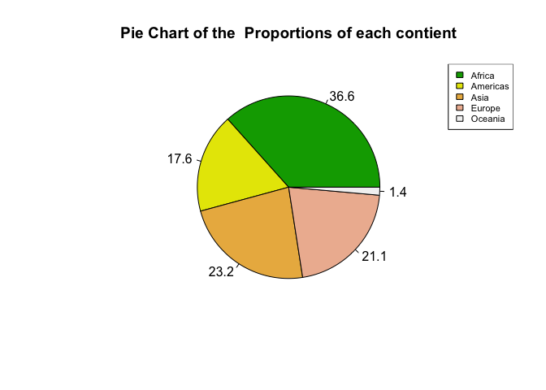
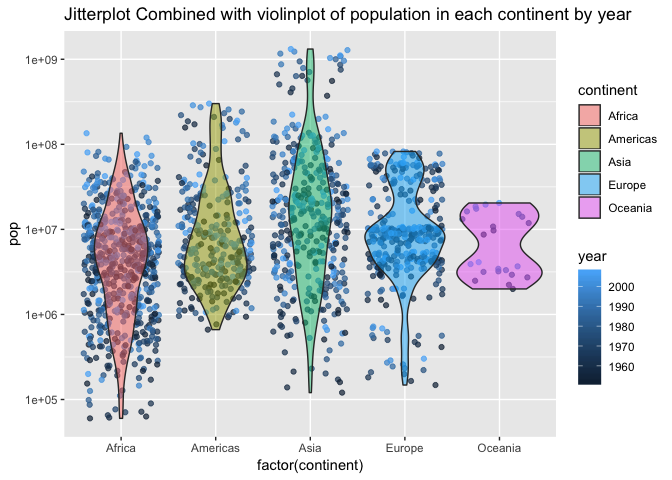
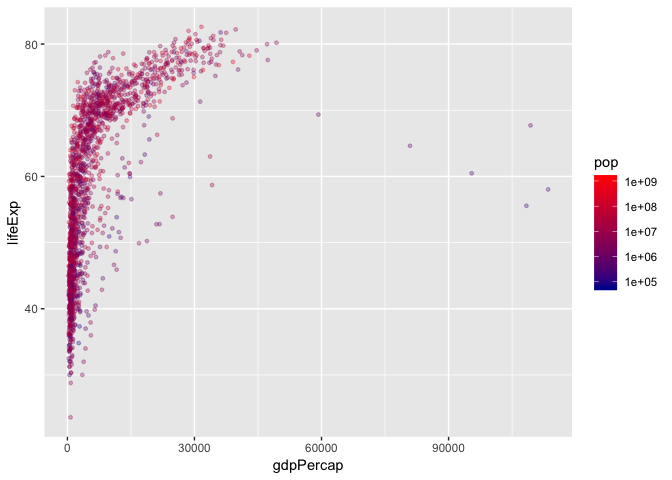
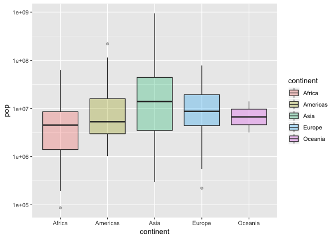

### Steps on exploration of a data frame
1. Understanding the structure of the data
    * [Bring rectangular data in]
    * [Smell test data]
2. Take a Look at of the data
    * [Explore individual variables]
3. Visulation of the data
    * [Explore individual variables]
    * [Explore various plot types]

#### Bring rectangular data in

*In this hw02, we are going to work with `gapminder` and `dplyr` data(Probably via the `tidyverse` meta-package). Install them if you have not done so already. I already intalled the packages, so I just comment out the commands.*

```r
#install.packages("gapminder")
#install.packages("tidyverse")
```

*Load them.*

```r
library(gapminder)
library(tidyverse)
```

```
## -- Attaching packages -------------------------------------------- tidyverse 1.2.1 --
```

```
## <U+221A> ggplot2 3.0.0     <U+221A> purrr   0.2.5
## <U+221A> tibble  1.4.2     <U+221A> dplyr   0.7.6
## <U+221A> tidyr   0.8.1     <U+221A> stringr 1.3.1
## <U+221A> readr   1.1.1     <U+221A> forcats 0.3.0
```

```
## -- Conflicts ----------------------------------------------- tidyverse_conflicts() --
## x dplyr::filter() masks stats::filter()
## x dplyr::lag()    masks stats::lag()
```

```r
library(knitr)
```

#### Smell test data

*The purpose of this part is to explore `gapminder` object.*


1, **Is it a data.frame, a matrix, a vector, a list**


```r
mode(gapminder)
```

```
## [1] "list"
```

```r
typeof(gapminder)
```

```
## [1] "list"
```

*After solved my confustion about the difference between `mode` and `typeof`, I knew that they all show the type or storage mode of any object
but the set of names might be different.*

>Modes have the same set of names as types (see typeof) except that
>
>   * types "integer" and "double" are returned as "numeric".
>  
>   * types "special" and "builtin" are returned as "function".
>  
>   * type "symbol" is called mode "name".
>  
>   * type "language" is returned as "(" or "call".
>
>From [R Documentation](https://www.rdocumentation.org/packages/base/versions/3.5.1/topics/mode)

*According to words mentioned above, use`mode` and `typeof` will generate the same output `list` in `gapminder`.*

2, **What is its class?**


```r
class(gapminder)
```

```
## [1] "tbl_df"     "tbl"        "data.frame"
```

3, **How many variables/columns?**


```r
ncol(gapminder)
```

```
## [1] 6
```

4, **How many rows/observations?**


```r
nrow(gapminder)
```

```
## [1] 1704
```


5, **Can you get these facts about ???extent??? or ???size??? in more than one way? Can you imagine different functions being useful in different contexts?**

*From Q3 and Q4, dimension of `gapminder` can get repectively. 1st method works when you only need to know the dimension, while 2nd method works when you also care about the data type and want to preview the data it contained *


```r
dim(gapminder)
```

```
## [1] 1704    6
```

* Another method


```r
# Tells the dimension of the data frame,shows the name of each variable followed by its data type and the preview of data contained in it.
str(gapminder)
```

```
## Classes 'tbl_df', 'tbl' and 'data.frame':	1704 obs. of  6 variables:
##  $ country  : Factor w/ 142 levels "Afghanistan",..: 1 1 1 1 1 1 1 1 1 1 ...
##  $ continent: Factor w/ 5 levels "Africa","Americas",..: 3 3 3 3 3 3 3 3 3 3 ...
##  $ year     : int  1952 1957 1962 1967 1972 1977 1982 1987 1992 1997 ...
##  $ lifeExp  : num  28.8 30.3 32 34 36.1 ...
##  $ pop      : int  8425333 9240934 10267083 11537966 13079460 14880372 12881816 13867957 16317921 22227415 ...
##  $ gdpPercap: num  779 821 853 836 740 ...
```

6, What data type is each variable?


```r
head(gapminder)
```

```
## # A tibble: 6 x 6
##   country     continent  year lifeExp      pop gdpPercap
##   <fct>       <fct>     <int>   <dbl>    <int>     <dbl>
## 1 Afghanistan Asia       1952    28.8  8425333      779.
## 2 Afghanistan Asia       1957    30.3  9240934      821.
## 3 Afghanistan Asia       1962    32.0 10267083      853.
## 4 Afghanistan Asia       1967    34.0 11537966      836.
## 5 Afghanistan Asia       1972    36.1 13079460      740.
## 6 Afghanistan Asia       1977    38.4 14880372      786.
```

* Another method


```r
#returns a list of the same length as 'gapminder', each element of which is the result of applying CLASS to the corresponding element of 'gapminder'.
lapply(gapminder,class)
```

```
## $country
## [1] "factor"
## 
## $continent
## [1] "factor"
## 
## $year
## [1] "integer"
## 
## $lifeExp
## [1] "numeric"
## 
## $pop
## [1] "integer"
## 
## $gdpPercap
## [1] "numeric"
```


#### Explore individual variables

**Pick at least one categorical variable and at least one quantitative variable to explore.**

##### Explore categorical variable `continent`
 

  * **What are possible values (or range, whichever is appropriate) of each variable?**

  * **Feel free to use summary stats, tables, figures. We???re NOT expecting high production value (yet).**
  
  * **What values are typical? What???s the spread? What???s the distribution? Etc., tailored to the variable at hand.**
  

*After knew the data type of each variable, I picked `continent` as categorical variable and `pop` as quantitative variable. **For `continent`** *

*Firstly, to get access to the levels attribute of a variable, I used `levels`, it returns the value of the levels of its argument.*


```r
levels(gapminder$continent)
```

```
## [1] "Africa"   "Americas" "Asia"     "Europe"   "Oceania"
```

*Also, to get distinct arguments of variable `continent`, I used `unique`*


```r
unique(gapminder$continent)
```

```
## [1] Asia     Europe   Africa   Americas Oceania 
## Levels: Africa Americas Asia Europe Oceania
```

*After that, `summary` is chosen to describe the result summaries.* 


```r
summary(gapminder$continent)
```

```
##   Africa Americas     Asia   Europe  Oceania 
##      624      300      396      360       24
```


```r
continent.counts <- table(gapminder$continent)
continent.counts
```

```
## 
##   Africa Americas     Asia   Europe  Oceania 
##      624      300      396      360       24
```

```r
continent.prop <- continent.counts / sum(continent.counts)
continent.prop
```

```
## 
##     Africa   Americas       Asia     Europe    Oceania 
## 0.36619718 0.17605634 0.23239437 0.21126761 0.01408451
```

*After the exploration on the number of countries in each continent. Barplot is applied to display the counts of categorial variable*


```r
barplot(continent.counts, col = cm.colors(length(continent.counts)), xlab = "continents", ylab = "count",xlim = NULL, ylim =c(0,800), main = "number of countries in each continent")
```

<!-- -->

*To get a more directly overview of each continent, I converted counts of each continent to proportions and visualized the proportions in a pie chart.*
  

```r
lab <- levels(gapminder$continent)
piepercent <- round(100*continent.prop,1)
pie(continent.counts,labels = piepercent, 
    main="Pie Chart of the  Proportions of each contient",
    col = terrain.colors(length(continent.counts)))
legend("topright",lab,cex=0.7,
       fill = terrain.colors(length(continent.counts)))
```

<!-- -->

  
  
##### Explore quantitative variable `pop` 

  * **What are possible values (or range, whichever is appropriate) of each variable?**
  
  * **What values are typical? What???s the spread? What???s the distribution? Etc., tailored to the variable at hand.**
  
  * **Feel free to use summary stats, tables, figures. We???re NOT expecting high production value (yet).**
  
*For quantitative variable `pop`, it's good to obtain the range of it by `range` and minimum, 1st quartiles, median, mean, 3rd quartiles and maximum values by `summary` at first.*
  

```r
  range(gapminder$pop)
```

```
## [1]      60011 1318683096
```

```r
  summary(gapminder$pop)
```

```
##      Min.   1st Qu.    Median      Mean   3rd Qu.      Max. 
## 6.001e+04 2.794e+06 7.024e+06 2.960e+07 1.959e+07 1.319e+09
```

*To preview the first and last 5th line of `pop` variable*

```r
head(gapminder$pop,n=5)
```

```
## [1]  8425333  9240934 10267083 11537966 13079460
```

```r
tail(gapminder$pop,n=5)
```

```
## [1]  9216418 10704340 11404948 11926563 12311143
```

*Check the distribution of the `pop` variable*

```r
gapminder %>%
  ggplot(aes(x=pop)) +
  geom_histogram(bins=30,fill='yellow',alpha=0.5) +
  scale_x_log10()
```

<!-- -->

*Combination of histogram and density plot*

```r
gapminder %>%
  ggplot(aes(pop)) +
  geom_histogram(aes(y=..density..),bins=30,fill='yellow',alpha=0.5) +
  geom_density(alpha=0.2,fill='blue') +
  scale_x_log10()
```

<!-- -->

#### Explore various plot types
**Make a few plots, probably of the same variable you chose to characterize numerically. You can use the plot types we went over in class (cm006) to get an idea of what you???d like to make. Try to explore more than one plot type. Just as an example of what I mean:**

    A scatterplot of two quantitative variables.
    A plot of one quantitative variable. Maybe a histogram or densityplot or frequency polygon.
    A plot of one quantitative variable and one categorical. Maybe boxplots for several continents or countries.
    
**You don???t have to use all the data in every plot! It???s fine to filter down to one country or small handful of countries.**

*We can explore the relationship between population and year in each continent*


```r
ggplot(gapminder,aes(factor(continent),pop , color = year)) + 
  scale_y_log10() +
  geom_jitter(alpha = 0.7) +
  geom_violin(aes(fill = continent),alpha = 0.5) +
  labs(title = "Jitterplot Combined with violinplot of population in each continent by year")
```

<!-- -->

*From this plot, it can be noticed that the range of population in Asia is higher than other continents, and the population density in Oceania is lower in almost any time.*

*I'm going to use scatterplot to display the relationship between `lifeExp`,`gdpPercap` in each continent in different years*


```r
ggplot( gapminder, aes(x=gdpPercap , y=lifeExp, color=pop)) + 
  geom_point(size=1,alpha=0.3) + 
  scale_color_continuous(trans="log10",low="#000099",high="#FF0000",space="Lab") 
```

<!-- -->


*From the output plot,I think `gdpPercap` is increase with the increase of `lifeExp`,the same trend of population might also works.*

*I will now make a conparision between the population of each continent in the year of 1977.*


```r
d <- gapminder %>%
  filter(year==1977)

ggplot(d, aes(x=continent, y=pop, fill=continent)) + 
    geom_boxplot(alpha=0.3) +
    scale_y_log10() 
```

<!-- -->


*After observation, the population of Asia and the range of it is higher than other areas.*

#### Use filter(), select() and %>%

**Use filter() to create data subsets that you want to plot.**

    Practice piping together filter() and select(). Possibly even piping into ggplot().


*In the following part,I will install `plotly` library to get an interactive version, unfortunately, the interactive version isn't fit for github, but it works well in R.* 

*To take a preview, I uploaded the 'gif' effect, hope you still enjoy it.*

*If you still want to explore the interactive version by yourself, please feel free to download the `.Rmd` file.*
*The purpose of this interactive version output is to fint out the exact value of some variables(`lifeExp`,`gdpPercap`,`pop`,`continent`) in the year of 1967.*


```r
#install.packages("plotly")
library(ggplot2)
library(plotly)
```

```
## 
## Attaching package: 'plotly'
```

```
## The following object is masked from 'package:ggplot2':
## 
##     last_plot
```

```
## The following object is masked from 'package:stats':
## 
##     filter
```

```
## The following object is masked from 'package:graphics':
## 
##     layout
```

```r
a <- gapminder %>%
  select(-country) %>%
  filter(year==1967) %>%
  ggplot( aes(lifeExp,gdpPercap,size = pop, color=continent)) +
  geom_point() +
  scale_y_log10() +
  theme_bw()
 
ggplotly(a)
```

<!--html_preserve--><div id="htmlwidget-c31e489477beb2bea19b" style="width:672px;height:480px;" class="plotly html-widget"></div>
<script type="application/json" data-for="htmlwidget-c31e489477beb2bea19b">{"x":{"data":[{"x":[51.407,35.985,44.885,53.298,40.697,43.548,44.799,41.478,43.601,46.472,44.056,52.04,47.35,42.074,49.293,38.987,42.189,42.115,44.598,35.857,48.072,37.197,35.492,50.654,48.492,41.536,50.227,42.881,39.487,38.487,46.289,61.557,50.335,38.113,51.159,40.118,41.04,60.542,44.1,54.425,43.563,34.113,38.977,51.927,42.858,46.633,45.757,46.769,52.053,48.051,47.768,53.995],"y":[3.51148118797499,3.74215745838396,3.01528907661539,3.08447235438054,2.90027237094209,2.61592640520288,3.1785318256936,3.055399974834,3.078025414328,3.27323969635094,2.93530228406906,3.4278007842362,3.31218803864046,3.48001420697493,3.25884808894596,2.96170388787321,2.67098294312012,2.71274954741178,3.9221419590145,2.866159048101,3.05142157041711,2.8504989181547,2.85465858235922,3.02396669067389,2.69778626600553,2.8534570617051,4.27352793571109,3.2132646189128,2.69505661348785,2.73640438110395,3.15263845040986,3.39364320442555,3.23326137313525,2.7533295728751,3.57906238390086,3.02299917399278,3.00625808906951,3.60435305365754,2.70839006005204,3.14139978526705,3.20747403709274,3.08136295976889,3.10881294051872,3.85214303897666,3.22737183535753,3.41715630666173,2.92850782101237,3.16955593013409,3.28608807651144,2.95852495345071,3.24970632372554,2.75571868821708],"text":["lifeExp: 51.40700<br />gdpPercap:  3246.9918<br />pop:  12760499<br />continent: Africa","lifeExp: 35.98500<br />gdpPercap:  5522.7764<br />pop:   5247469<br />continent: Africa","lifeExp: 44.88500<br />gdpPercap:  1035.8314<br />pop:   2427334<br />continent: Africa","lifeExp: 53.29800<br />gdpPercap:  1214.7093<br />pop:    553541<br />continent: Africa","lifeExp: 40.69700<br />gdpPercap:   794.8266<br />pop:   5127935<br />continent: Africa","lifeExp: 43.54800<br />gdpPercap:   412.9775<br />pop:   3330989<br />continent: Africa","lifeExp: 44.79900<br />gdpPercap:  1508.4531<br />pop:   6335506<br />continent: Africa","lifeExp: 41.47800<br />gdpPercap:  1136.0566<br />pop:   1733638<br />continent: Africa","lifeExp: 43.60100<br />gdpPercap:  1196.8106<br />pop:   3495967<br />continent: Africa","lifeExp: 46.47200<br />gdpPercap:  1876.0296<br />pop:    217378<br />continent: Africa","lifeExp: 44.05600<br />gdpPercap:   861.5932<br />pop:  19941073<br />continent: Africa","lifeExp: 52.04000<br />gdpPercap:  2677.9396<br />pop:   1179760<br />continent: Africa","lifeExp: 47.35000<br />gdpPercap:  2052.0505<br />pop:   4744870<br />continent: Africa","lifeExp: 42.07400<br />gdpPercap:  3020.0505<br />pop:    127617<br />continent: Africa","lifeExp: 49.29300<br />gdpPercap:  1814.8807<br />pop:  31681188<br />continent: Africa","lifeExp: 38.98700<br />gdpPercap:   915.5960<br />pop:    259864<br />continent: Africa","lifeExp: 42.18900<br />gdpPercap:   468.7950<br />pop:   1820319<br />continent: Africa","lifeExp: 42.11500<br />gdpPercap:   516.1186<br />pop:  27860297<br />continent: Africa","lifeExp: 44.59800<br />gdpPercap:  8358.7620<br />pop:    489004<br />continent: Africa","lifeExp: 35.85700<br />gdpPercap:   734.7829<br />pop:    439593<br />continent: Africa","lifeExp: 48.07200<br />gdpPercap:  1125.6972<br />pop:   8490213<br />continent: Africa","lifeExp: 37.19700<br />gdpPercap:   708.7595<br />pop:   3451418<br />continent: Africa","lifeExp: 35.49200<br />gdpPercap:   715.5806<br />pop:    601287<br />continent: Africa","lifeExp: 50.65400<br />gdpPercap:  1056.7365<br />pop:  10191512<br />continent: Africa","lifeExp: 48.49200<br />gdpPercap:   498.6390<br />pop:    996380<br />continent: Africa","lifeExp: 41.53600<br />gdpPercap:   713.6036<br />pop:   1279406<br />continent: Africa","lifeExp: 50.22700<br />gdpPercap: 18772.7517<br />pop:   1759224<br />continent: Africa","lifeExp: 42.88100<br />gdpPercap:  1634.0473<br />pop:   6334556<br />continent: Africa","lifeExp: 39.48700<br />gdpPercap:   495.5148<br />pop:   4147252<br />continent: Africa","lifeExp: 38.48700<br />gdpPercap:   545.0099<br />pop:   5212416<br />continent: Africa","lifeExp: 46.28900<br />gdpPercap:  1421.1452<br />pop:   1230542<br />continent: Africa","lifeExp: 61.55700<br />gdpPercap:  2475.3876<br />pop:    789309<br />continent: Africa","lifeExp: 50.33500<br />gdpPercap:  1711.0448<br />pop:  14770296<br />continent: Africa","lifeExp: 38.11300<br />gdpPercap:   566.6692<br />pop:   8680909<br />continent: Africa","lifeExp: 51.15900<br />gdpPercap:  3793.6948<br />pop:    706640<br />continent: Africa","lifeExp: 40.11800<br />gdpPercap:  1054.3849<br />pop:   4534062<br />continent: Africa","lifeExp: 41.04000<br />gdpPercap:  1014.5141<br />pop:  47287752<br />continent: Africa","lifeExp: 60.54200<br />gdpPercap:  4021.1757<br />pop:    414024<br />continent: Africa","lifeExp: 44.10000<br />gdpPercap:   510.9637<br />pop:   3451079<br />continent: Africa","lifeExp: 54.42500<br />gdpPercap:  1384.8406<br />pop:     70787<br />continent: Africa","lifeExp: 43.56300<br />gdpPercap:  1612.4046<br />pop:   3965841<br />continent: Africa","lifeExp: 34.11300<br />gdpPercap:  1206.0435<br />pop:   2662190<br />continent: Africa","lifeExp: 38.97700<br />gdpPercap:  1284.7332<br />pop:   3428839<br />continent: Africa","lifeExp: 51.92700<br />gdpPercap:  7114.4780<br />pop:  20997321<br />continent: Africa","lifeExp: 42.85800<br />gdpPercap:  1687.9976<br />pop:  12716129<br />continent: Africa","lifeExp: 46.63300<br />gdpPercap:  2613.1017<br />pop:    420690<br />continent: Africa","lifeExp: 45.75700<br />gdpPercap:   848.2187<br />pop:  12607312<br />continent: Africa","lifeExp: 46.76900<br />gdpPercap:  1477.5968<br />pop:   1735550<br />continent: Africa","lifeExp: 52.05300<br />gdpPercap:  1932.3602<br />pop:   4786986<br />continent: Africa","lifeExp: 48.05100<br />gdpPercap:   908.9185<br />pop:   8900294<br />continent: Africa","lifeExp: 47.76800<br />gdpPercap:  1777.0773<br />pop:   3900000<br />continent: Africa","lifeExp: 53.99500<br />gdpPercap:   569.7951<br />pop:   4995432<br />continent: Africa"],"type":"scatter","mode":"markers","marker":{"autocolorscale":false,"color":"rgba(248,118,109,1)","opacity":1,"size":[6.23033823882774,5.34487095391705,4.83566863638713,4.25754838925716,5.32669284741034,5.02176935170475,5.50153363393661,4.66670512098506,5.05281243648271,4.04294075954683,6.8463309896338,4.50403753146021,5.26694233482354,3.94353845814101,7.64763816502546,4.07868735808798,4.68953475498293,7.40633356213938,4.22445042139745,4.19734144568154,5.77582441801779,5.04450495796064,4.28063006599633,5.96824497427764,4.44142989243661,4.53588762313805,4.67350448930909,5.50140306401048,5.16860270346336,5.33956222687268,4.52044020619855,4.36270929777781,6.41728766483351,5.7983054225943,4.32813569461946,5.2330130619791,8.50704255825511,4.18259798106924,5.04444153221422,3.77952755905512,5.13734262393393,4.88704700395513,5.0402735326146,6.92678691335833,6.22604981637089,4.18649317184353,6.21550053969125,4.66721502721481,5.27362851037454,5.82386277045545,5.12581763259667,5.30628957247822],"symbol":"circle","line":{"width":1.88976377952756,"color":"rgba(248,118,109,1)"}},"hoveron":"points","name":"Africa","legendgroup":"Africa","showlegend":true,"xaxis":"x","yaxis":"y","hoverinfo":"text","frame":null},{"x":[65.634,45.032,57.632,72.13,60.523,59.963,65.424,68.29,56.751,56.678,55.855,50.016,46.243,50.924,67.51,60.11,51.884,64.071,64.951,51.445,71.1,65.4,70.76,68.468,63.479],"y":[3.90595516552978,3.41277729936084,3.53527694506573,4.206193882909,3.70813645996287,3.42792891541937,3.61927367509308,3.75513272240462,3.21846276740337,3.6607776823798,3.63934655547257,3.51088415650793,3.16198386397309,3.40453770699663,3.78708506565499,3.76002524528695,3.66683549228173,3.64552140726666,3.36161005279027,3.76253552527651,3.84068796748737,3.74984205355686,4.29071037250177,3.73596754383367,3.97961547976198],"text":["lifeExp: 65.63400<br />gdpPercap:  8052.9530<br />pop:  22934225<br />continent: Americas","lifeExp: 45.03200<br />gdpPercap:  2586.8861<br />pop:   4040665<br />continent: Americas","lifeExp: 57.63200<br />gdpPercap:  3429.8644<br />pop:  88049823<br />continent: Americas","lifeExp: 72.13000<br />gdpPercap: 16076.5880<br />pop:  20819767<br />continent: Americas","lifeExp: 60.52300<br />gdpPercap:  5106.6543<br />pop:   8858908<br />continent: Americas","lifeExp: 59.96300<br />gdpPercap:  2678.7298<br />pop:  19764027<br />continent: Americas","lifeExp: 65.42400<br />gdpPercap:  4161.7278<br />pop:   1588717<br />continent: Americas","lifeExp: 68.29000<br />gdpPercap:  5690.2680<br />pop:   8139332<br />continent: Americas","lifeExp: 56.75100<br />gdpPercap:  1653.7230<br />pop:   4049146<br />continent: Americas","lifeExp: 56.67800<br />gdpPercap:  4579.0742<br />pop:   5432424<br />continent: Americas","lifeExp: 55.85500<br />gdpPercap:  4358.5954<br />pop:   3232927<br />continent: Americas","lifeExp: 50.01600<br />gdpPercap:  3242.5311<br />pop:   4690773<br />continent: Americas","lifeExp: 46.24300<br />gdpPercap:  1452.0577<br />pop:   4318137<br />continent: Americas","lifeExp: 50.92400<br />gdpPercap:  2538.2694<br />pop:   2500689<br />continent: Americas","lifeExp: 67.51000<br />gdpPercap:  6124.7035<br />pop:   1861096<br />continent: Americas","lifeExp: 60.11000<br />gdpPercap:  5754.7339<br />pop:  47995559<br />continent: Americas","lifeExp: 51.88400<br />gdpPercap:  4643.3935<br />pop:   1865490<br />continent: Americas","lifeExp: 64.07100<br />gdpPercap:  4421.0091<br />pop:   1405486<br />continent: Americas","lifeExp: 64.95100<br />gdpPercap:  2299.3763<br />pop:   2287985<br />continent: Americas","lifeExp: 51.44500<br />gdpPercap:  5788.0933<br />pop:  12132200<br />continent: Americas","lifeExp: 71.10000<br />gdpPercap:  6929.2777<br />pop:   2648961<br />continent: Americas","lifeExp: 65.40000<br />gdpPercap:  5621.3685<br />pop:    960155<br />continent: Americas","lifeExp: 70.76000<br />gdpPercap: 19530.3656<br />pop: 198712000<br />continent: Americas","lifeExp: 68.46800<br />gdpPercap:  5444.6196<br />pop:   2748579<br />continent: Americas","lifeExp: 63.47900<br />gdpPercap:  9541.4742<br />pop:   9709552<br />continent: Americas"],"type":"scatter","mode":"markers","marker":{"autocolorscale":false,"color":"rgba(163,165,0,1)","opacity":1,"size":[7.06921509598972,5.15032240097336,10.2327031267296,6.91340679832774,5.81906600019338,6.83263767475846,4.62716426194752,5.73378373939448,5.15178586012333,5.37258921704947,5.00294432620446,5.25830974793892,5.19741875686476,4.85198053970352,4.70007861135165,8.54234471211845,4.70120758475491,4.57435993489779,4.80396659889441,6.16889518820328,4.88421646750912,4.42834816011854,13.4761070174452,4.90535622165549,5.91549474907475],"symbol":"circle","line":{"width":1.88976377952756,"color":"rgba(163,165,0,1)"}},"hoveron":"points","name":"Americas","legendgroup":"Americas","showlegend":true,"xaxis":"x","yaxis":"y","hoverinfo":"text","frame":null},{"x":[34.02,59.923,43.453,45.415,58.38112,70,47.193,45.964,52.469,54.459,70.75,71.43,51.629,59.942,57.716,64.624,63.87,59.371,51.253,49.379,41.472,46.988,49.8,56.393,49.901,67.946,64.266,53.655,67.5,58.285,47.838,51.631,36.984],"y":[2.92230867688807,4.17039881049903,2.85804733931374,2.71886053038935,2.78725191591334,3.7922489662687,2.84557587986314,2.88220098595162,3.77134725217608,3.95092244836757,3.92395558525362,3.99333871744166,3.43803517841855,3.3311317155572,3.30733087662514,4.90792105261074,3.77865640591502,3.35750460546659,3.08850503970313,2.54282542695918,2.83023070963807,3.67402872805872,2.9742390834018,3.25866779000196,4.22796504684151,3.6970041611318,3.05519261778385,3.27460199588512,3.4222382376131,3.11242422905142,2.80422348009232,3.42319916542994,2.9357299717043],"text":["lifeExp: 34.02000<br />gdpPercap:   836.1971<br />pop:  11537966<br />continent: Asia","lifeExp: 59.92300<br />gdpPercap: 14804.6727<br />pop:    202182<br />continent: Asia","lifeExp: 43.45300<br />gdpPercap:   721.1861<br />pop:  62821884<br />continent: Asia","lifeExp: 45.41500<br />gdpPercap:   523.4323<br />pop:   6960067<br />continent: Asia","lifeExp: 58.38112<br />gdpPercap:   612.7057<br />pop: 754550000<br />continent: Asia","lifeExp: 70.00000<br />gdpPercap:  6197.9628<br />pop:   3722800<br />continent: Asia","lifeExp: 47.19300<br />gdpPercap:   700.7706<br />pop: 506000000<br />continent: Asia","lifeExp: 45.96400<br />gdpPercap:   762.4318<br />pop: 109343000<br />continent: Asia","lifeExp: 52.46900<br />gdpPercap:  5906.7318<br />pop:  26538000<br />continent: Asia","lifeExp: 54.45900<br />gdpPercap:  8931.4598<br />pop:   8519282<br />continent: Asia","lifeExp: 70.75000<br />gdpPercap:  8393.7414<br />pop:   2693585<br />continent: Asia","lifeExp: 71.43000<br />gdpPercap:  9847.7886<br />pop: 100825279<br />continent: Asia","lifeExp: 51.62900<br />gdpPercap:  2741.7963<br />pop:   1255058<br />continent: Asia","lifeExp: 59.94200<br />gdpPercap:  2143.5406<br />pop:  12617009<br />continent: Asia","lifeExp: 57.71600<br />gdpPercap:  2029.2281<br />pop:  30131000<br />continent: Asia","lifeExp: 64.62400<br />gdpPercap: 80894.8833<br />pop:    575003<br />continent: Asia","lifeExp: 63.87000<br />gdpPercap:  6006.9830<br />pop:   2186894<br />continent: Asia","lifeExp: 59.37100<br />gdpPercap:  2277.7424<br />pop:  10154878<br />continent: Asia","lifeExp: 51.25300<br />gdpPercap:  1226.0411<br />pop:   1149500<br />continent: Asia","lifeExp: 49.37900<br />gdpPercap:   349.0000<br />pop:  25870271<br />continent: Asia","lifeExp: 41.47200<br />gdpPercap:   676.4422<br />pop:  11261690<br />continent: Asia","lifeExp: 46.98800<br />gdpPercap:  4720.9427<br />pop:    714775<br />continent: Asia","lifeExp: 49.80000<br />gdpPercap:   942.4083<br />pop:  60641899<br />continent: Asia","lifeExp: 56.39300<br />gdpPercap:  1814.1274<br />pop:  35356600<br />continent: Asia","lifeExp: 49.90100<br />gdpPercap: 16903.0489<br />pop:   5618198<br />continent: Asia","lifeExp: 67.94600<br />gdpPercap:  4977.4185<br />pop:   1977600<br />continent: Asia","lifeExp: 64.26600<br />gdpPercap:  1135.5143<br />pop:  11737396<br />continent: Asia","lifeExp: 53.65500<br />gdpPercap:  1881.9236<br />pop:   5680812<br />continent: Asia","lifeExp: 67.50000<br />gdpPercap:  2643.8587<br />pop:  13648692<br />continent: Asia","lifeExp: 58.28500<br />gdpPercap:  1295.4607<br />pop:  34024249<br />continent: Asia","lifeExp: 47.83800<br />gdpPercap:   637.1233<br />pop:  39463910<br />continent: Asia","lifeExp: 51.63100<br />gdpPercap:  2649.7150<br />pop:   1142636<br />continent: Asia","lifeExp: 36.98400<br />gdpPercap:   862.4421<br />pop:   6740785<br />continent: Asia"],"type":"scatter","mode":"markers","marker":{"autocolorscale":false,"color":"rgba(0,191,125,1)","opacity":1,"size":[6.10929288443488,4.02891426622587,9.22950296653832,5.58533234364655,22.6771653543307,5.09429832442492,19.2544599313275,10.9713465899228,7.31899553707347,5.77926766644243,4.89373563830258,10.6853608506678,4.52823030960431,6.21644246992819,7.55159898860169,4.26805863263155,4.7803399951265,5.96428013165766,4.49408449258219,7.27406253302449,6.08105653534227,4.3316339428628,9.13399959432194,7.86633283571334,5.39995299982871,4.72955890170034,6.12946446976002,5.40907226490639,6.31465773183191,7.78843392513836,8.09764139676554,4.49180745222687,5.55636105694027],"symbol":"circle","line":{"width":1.88976377952756,"color":"rgba(0,191,125,1)"}},"hoveron":"points","name":"Asia","legendgroup":"Asia","showlegend":true,"xaxis":"x","yaxis":"y","hoverinfo":"text","frame":null},{"x":[66.22,70.14,70.94,64.79,70.42,68.5,70.38,72.96,69.83,71.55,70.8,71,69.5,73.73,71.08,71.06,67.178,73.82,74.08,69.61,66.6,66.8,66.914,70.98,69.18,71.44,74.16,72.77,54.336,71.36],"y":[3.44094006865781,4.10838241931361,4.11889408582397,3.33693028267941,3.74640086253428,3.84262782533193,4.05688370334703,4.2024123287676,4.03828770846528,4.11394060154369,4.16866320301241,3.93008758267857,3.96972543116429,4.12450082349962,3.88397747306288,4.00097178847123,3.7714295289461,4.18648313615635,4.21383310947184,3.81671530247097,3.80356075988127,3.81096244303535,3.90263955655535,3.92494585044061,3.97338139817314,3.90273764724083,4.18350606325153,4.36108808961809,3.451226922958,4.15053696257245],"text":["lifeExp: 66.22000<br />gdpPercap:  2760.1969<br />pop:   1984060<br />continent: Europe","lifeExp: 70.14000<br />gdpPercap: 12834.6024<br />pop:   7376998<br />continent: Europe","lifeExp: 70.94000<br />gdpPercap: 13149.0412<br />pop:   9556500<br />continent: Europe","lifeExp: 64.79000<br />gdpPercap:  2172.3524<br />pop:   3585000<br />continent: Europe","lifeExp: 70.42000<br />gdpPercap:  5577.0028<br />pop:   8310226<br />continent: Europe","lifeExp: 68.50000<br />gdpPercap:  6960.2979<br />pop:   4174366<br />continent: Europe","lifeExp: 70.38000<br />gdpPercap: 11399.4449<br />pop:   9835109<br />continent: Europe","lifeExp: 72.96000<br />gdpPercap: 15937.2112<br />pop:   4838800<br />continent: Europe","lifeExp: 69.83000<br />gdpPercap: 10921.6363<br />pop:   4605744<br />continent: Europe","lifeExp: 71.55000<br />gdpPercap: 12999.9177<br />pop:  49569000<br />continent: Europe","lifeExp: 70.80000<br />gdpPercap: 14745.6256<br />pop:  76368453<br />continent: Europe","lifeExp: 71.00000<br />gdpPercap:  8513.0970<br />pop:   8716441<br />continent: Europe","lifeExp: 69.50000<br />gdpPercap:  9326.6447<br />pop:  10223422<br />continent: Europe","lifeExp: 73.73000<br />gdpPercap: 13319.8957<br />pop:    198676<br />continent: Europe","lifeExp: 71.08000<br />gdpPercap:  7655.5690<br />pop:   2900100<br />continent: Europe","lifeExp: 71.06000<br />gdpPercap: 10022.4013<br />pop:  52667100<br />continent: Europe","lifeExp: 67.17800<br />gdpPercap:  5907.8509<br />pop:    501035<br />continent: Europe","lifeExp: 73.82000<br />gdpPercap: 15363.2514<br />pop:  12596822<br />continent: Europe","lifeExp: 74.08000<br />gdpPercap: 16361.8765<br />pop:   3786019<br />continent: Europe","lifeExp: 69.61000<br />gdpPercap:  6557.1528<br />pop:  31785378<br />continent: Europe","lifeExp: 66.60000<br />gdpPercap:  6361.5180<br />pop:   9103000<br />continent: Europe","lifeExp: 66.80000<br />gdpPercap:  6470.8665<br />pop:  19284814<br />continent: Europe","lifeExp: 66.91400<br />gdpPercap:  7991.7071<br />pop:   7971222<br />continent: Europe","lifeExp: 70.98000<br />gdpPercap:  8412.9024<br />pop:   4442238<br />continent: Europe","lifeExp: 69.18000<br />gdpPercap:  9405.4894<br />pop:   1646912<br />continent: Europe","lifeExp: 71.44000<br />gdpPercap:  7993.5123<br />pop:  32850275<br />continent: Europe","lifeExp: 74.16000<br />gdpPercap: 15258.2970<br />pop:   7867931<br />continent: Europe","lifeExp: 72.77000<br />gdpPercap: 22966.1443<br />pop:   6063000<br />continent: Europe","lifeExp: 54.33600<br />gdpPercap:  2826.3564<br />pop:  33411317<br />continent: Europe","lifeExp: 71.36000<br />gdpPercap: 14142.8509<br />pop:  54959000<br />continent: Europe"],"type":"scatter","mode":"markers","marker":{"autocolorscale":false,"color":"rgba(0,176,246,1)","opacity":1,"size":[4.73116682373482,5.63917230090186,5.89846859439357,5.06925494538894,5.75437114030769,5.17321466048832,5.92936156247761,5.28181347860347,5.24463835342869,8.61989846023504,9.78904372416993,5.80246665066887,5.97169270196098,4.02556458975396,4.93677006980012,8.76907931582552,4.2308046752411,6.21448117011798,5.1056293167808,7.65400769662778,5.84719632167782,6.79526188761155,5.71331788595636,5.21798391218369,4.64325995749257,7.71851833896679,5.70063502073394,5.46366488977027,7.75208450084482,8.87663076394504],"symbol":"circle","line":{"width":1.88976377952756,"color":"rgba(0,176,246,1)"}},"hoveron":"points","name":"Europe","legendgroup":"Europe","showlegend":true,"xaxis":"x","yaxis":"y","hoverinfo":"text","frame":null},{"x":[71.1,71.52],"y":[4.16214976656191,4.16028597892551],"text":["lifeExp: 71.10000<br />gdpPercap: 14526.1246<br />pop:  11872264<br />continent: Oceania","lifeExp: 71.52000<br />gdpPercap: 14463.9189<br />pop:   2728150<br />continent: Oceania"],"type":"scatter","mode":"markers","marker":{"autocolorscale":false,"color":"rgba(231,107,243,1)","opacity":1,"size":[6.14300827681461,4.90105349985226],"symbol":"circle","line":{"width":1.88976377952756,"color":"rgba(231,107,243,1)"}},"hoveron":"points","name":"Oceania","legendgroup":"Oceania","showlegend":true,"xaxis":"x","yaxis":"y","hoverinfo":"text","frame":null}],"layout":{"margin":{"t":26.2283105022831,"r":7.30593607305936,"b":40.1826484018265,"l":54.7945205479452},"plot_bgcolor":"rgba(255,255,255,1)","paper_bgcolor":"rgba(255,255,255,1)","font":{"color":"rgba(0,0,0,1)","family":"","size":14.6118721461187},"xaxis":{"domain":[0,1],"automargin":true,"type":"linear","autorange":false,"range":[32.013,76.167],"tickmode":"array","ticktext":["40","50","60","70"],"tickvals":[40,50,60,70],"categoryorder":"array","categoryarray":["40","50","60","70"],"nticks":null,"ticks":"outside","tickcolor":"rgba(51,51,51,1)","ticklen":3.65296803652968,"tickwidth":0.66417600664176,"showticklabels":true,"tickfont":{"color":"rgba(77,77,77,1)","family":"","size":11.689497716895},"tickangle":-0,"showline":false,"linecolor":null,"linewidth":0,"showgrid":true,"gridcolor":"rgba(235,235,235,1)","gridwidth":0.66417600664176,"zeroline":false,"anchor":"y","title":"lifeExp","titlefont":{"color":"rgba(0,0,0,1)","family":"","size":14.6118721461187},"hoverformat":".2f"},"yaxis":{"domain":[0,1],"automargin":true,"type":"linear","autorange":false,"range":[2.4245706456766,5.02617583389332],"tickmode":"array","ticktext":["1e+03","1e+04","1e+05"],"tickvals":[3,4,5],"categoryorder":"array","categoryarray":["1e+03","1e+04","1e+05"],"nticks":null,"ticks":"outside","tickcolor":"rgba(51,51,51,1)","ticklen":3.65296803652968,"tickwidth":0.66417600664176,"showticklabels":true,"tickfont":{"color":"rgba(77,77,77,1)","family":"","size":11.689497716895},"tickangle":-0,"showline":false,"linecolor":null,"linewidth":0,"showgrid":true,"gridcolor":"rgba(235,235,235,1)","gridwidth":0.66417600664176,"zeroline":false,"anchor":"x","title":"gdpPercap","titlefont":{"color":"rgba(0,0,0,1)","family":"","size":14.6118721461187},"hoverformat":".2f"},"shapes":[{"type":"rect","fillcolor":"transparent","line":{"color":"rgba(51,51,51,1)","width":0.66417600664176,"linetype":"solid"},"yref":"paper","xref":"paper","x0":0,"x1":1,"y0":0,"y1":1}],"showlegend":true,"legend":{"bgcolor":"rgba(255,255,255,1)","bordercolor":"transparent","borderwidth":1.88976377952756,"font":{"color":"rgba(0,0,0,1)","family":"","size":11.689497716895},"y":0.826771653543307},"annotations":[{"text":"pop<br />continent","x":1.02,"y":1,"showarrow":false,"ax":0,"ay":0,"font":{"color":"rgba(0,0,0,1)","family":"","size":14.6118721461187},"xref":"paper","yref":"paper","textangle":-0,"xanchor":"left","yanchor":"bottom","legendTitle":true}],"hovermode":"closest","barmode":"relative"},"config":{"doubleClick":"reset","modeBarButtonsToAdd":[{"name":"Collaborate","icon":{"width":1000,"ascent":500,"descent":-50,"path":"M487 375c7-10 9-23 5-36l-79-259c-3-12-11-23-22-31-11-8-22-12-35-12l-263 0c-15 0-29 5-43 15-13 10-23 23-28 37-5 13-5 25-1 37 0 0 0 3 1 7 1 5 1 8 1 11 0 2 0 4-1 6 0 3-1 5-1 6 1 2 2 4 3 6 1 2 2 4 4 6 2 3 4 5 5 7 5 7 9 16 13 26 4 10 7 19 9 26 0 2 0 5 0 9-1 4-1 6 0 8 0 2 2 5 4 8 3 3 5 5 5 7 4 6 8 15 12 26 4 11 7 19 7 26 1 1 0 4 0 9-1 4-1 7 0 8 1 2 3 5 6 8 4 4 6 6 6 7 4 5 8 13 13 24 4 11 7 20 7 28 1 1 0 4 0 7-1 3-1 6-1 7 0 2 1 4 3 6 1 1 3 4 5 6 2 3 3 5 5 6 1 2 3 5 4 9 2 3 3 7 5 10 1 3 2 6 4 10 2 4 4 7 6 9 2 3 4 5 7 7 3 2 7 3 11 3 3 0 8 0 13-1l0-1c7 2 12 2 14 2l218 0c14 0 25-5 32-16 8-10 10-23 6-37l-79-259c-7-22-13-37-20-43-7-7-19-10-37-10l-248 0c-5 0-9-2-11-5-2-3-2-7 0-12 4-13 18-20 41-20l264 0c5 0 10 2 16 5 5 3 8 6 10 11l85 282c2 5 2 10 2 17 7-3 13-7 17-13z m-304 0c-1-3-1-5 0-7 1-1 3-2 6-2l174 0c2 0 4 1 7 2 2 2 4 4 5 7l6 18c0 3 0 5-1 7-1 1-3 2-6 2l-173 0c-3 0-5-1-8-2-2-2-4-4-4-7z m-24-73c-1-3-1-5 0-7 2-2 3-2 6-2l174 0c2 0 5 0 7 2 3 2 4 4 5 7l6 18c1 2 0 5-1 6-1 2-3 3-5 3l-174 0c-3 0-5-1-7-3-3-1-4-4-5-6z"},"click":"function(gd) { \n        // is this being viewed in RStudio?\n        if (location.search == '?viewer_pane=1') {\n          alert('To learn about plotly for collaboration, visit:\\n https://cpsievert.github.io/plotly_book/plot-ly-for-collaboration.html');\n        } else {\n          window.open('https://cpsievert.github.io/plotly_book/plot-ly-for-collaboration.html', '_blank');\n        }\n      }"}],"cloud":false},"source":"A","attrs":{"41c533215203":{"x":{},"y":{},"size":{},"colour":{},"type":"scatter"}},"cur_data":"41c533215203","visdat":{"41c533215203":["function (y) ","x"]},"highlight":{"on":"plotly_click","persistent":false,"dynamic":false,"selectize":false,"opacityDim":0.2,"selected":{"opacity":1},"debounce":0},"base_url":"https://plot.ly"},"evals":["config.modeBarButtonsToAdd.0.click"],"jsHooks":[]}</script><!--/html_preserve-->


#### But I want to do more!

**Evaluate this code and describe the result. Presumably the analyst???s intent was to get the data for Rwanda and Afghanistan. Did they succeed? Why or why not? If not, what is the correct way to do this?**


*To vertify whether it's correct or not, just run it*


```r
gapminder %>%
  filter(country == c("Rwanda", "Afghanistan")) 
```

```
## # A tibble: 12 x 6
##    country     continent  year lifeExp      pop gdpPercap
##    <fct>       <fct>     <int>   <dbl>    <int>     <dbl>
##  1 Afghanistan Asia       1957    30.3  9240934      821.
##  2 Afghanistan Asia       1967    34.0 11537966      836.
##  3 Afghanistan Asia       1977    38.4 14880372      786.
##  4 Afghanistan Asia       1987    40.8 13867957      852.
##  5 Afghanistan Asia       1997    41.8 22227415      635.
##  6 Afghanistan Asia       2007    43.8 31889923      975.
##  7 Rwanda      Africa     1952    40    2534927      493.
##  8 Rwanda      Africa     1962    43    3051242      597.
##  9 Rwanda      Africa     1972    44.6  3992121      591.
## 10 Rwanda      Africa     1982    46.2  5507565      882.
## 11 Rwanda      Africa     1992    23.6  7290203      737.
## 12 Rwanda      Africa     2002    43.4  7852401      786.
```

`Still not sure, let's run it seperately`


```r
filter(gapminder, country == c("Rwanda"))
```

```
## # A tibble: 12 x 6
##    country continent  year lifeExp     pop gdpPercap
##    <fct>   <fct>     <int>   <dbl>   <int>     <dbl>
##  1 Rwanda  Africa     1952    40   2534927      493.
##  2 Rwanda  Africa     1957    41.5 2822082      540.
##  3 Rwanda  Africa     1962    43   3051242      597.
##  4 Rwanda  Africa     1967    44.1 3451079      511.
##  5 Rwanda  Africa     1972    44.6 3992121      591.
##  6 Rwanda  Africa     1977    45   4657072      670.
##  7 Rwanda  Africa     1982    46.2 5507565      882.
##  8 Rwanda  Africa     1987    44.0 6349365      848.
##  9 Rwanda  Africa     1992    23.6 7290203      737.
## 10 Rwanda  Africa     1997    36.1 7212583      590.
## 11 Rwanda  Africa     2002    43.4 7852401      786.
## 12 Rwanda  Africa     2007    46.2 8860588      863.
```

```r
filter(gapminder, country == c("Afghanistan"))
```

```
## # A tibble: 12 x 6
##    country     continent  year lifeExp      pop gdpPercap
##    <fct>       <fct>     <int>   <dbl>    <int>     <dbl>
##  1 Afghanistan Asia       1952    28.8  8425333      779.
##  2 Afghanistan Asia       1957    30.3  9240934      821.
##  3 Afghanistan Asia       1962    32.0 10267083      853.
##  4 Afghanistan Asia       1967    34.0 11537966      836.
##  5 Afghanistan Asia       1972    36.1 13079460      740.
##  6 Afghanistan Asia       1977    38.4 14880372      786.
##  7 Afghanistan Asia       1982    39.9 12881816      978.
##  8 Afghanistan Asia       1987    40.8 13867957      852.
##  9 Afghanistan Asia       1992    41.7 16317921      649.
## 10 Afghanistan Asia       1997    41.8 22227415      635.
## 11 Afghanistan Asia       2002    42.1 25268405      727.
## 12 Afghanistan Asia       2007    43.8 31889923      975.
```

*By observation, it seems like the 1st method overlapped some data since the 2 countries appeared in the same year. To solve the problem, by introducing `%in%`, it is value matching and  "returns a vector of the positions of (first) matches of its first argument in its second", while `==` is logical operator, in this case, which means some variables are overlapped since one of its attribute(eg. year) happened to be the same. Fixed version:*


```r
gapminder %>%
  filter(country %in% c("Rwanda", "Afghanistan"))
```

```
## # A tibble: 24 x 6
##    country     continent  year lifeExp      pop gdpPercap
##    <fct>       <fct>     <int>   <dbl>    <int>     <dbl>
##  1 Afghanistan Asia       1952    28.8  8425333      779.
##  2 Afghanistan Asia       1957    30.3  9240934      821.
##  3 Afghanistan Asia       1962    32.0 10267083      853.
##  4 Afghanistan Asia       1967    34.0 11537966      836.
##  5 Afghanistan Asia       1972    36.1 13079460      740.
##  6 Afghanistan Asia       1977    38.4 14880372      786.
##  7 Afghanistan Asia       1982    39.9 12881816      978.
##  8 Afghanistan Asia       1987    40.8 13867957      852.
##  9 Afghanistan Asia       1992    41.7 16317921      649.
## 10 Afghanistan Asia       1997    41.8 22227415      635.
## # ... with 14 more rows
```

